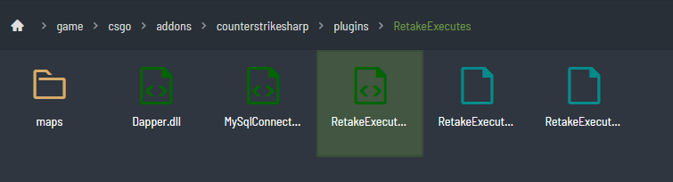

# cs2-retake-executes

CS2 implementation of Retake Executes written in [CounterStrikeSharp](https://docs.cssharp.dev/docs/guides/getting-started.html). 

Live @ **103.62.51.209:27058** via the CS2 Server Browser 
Skin and weapon preference changer live @ **[www.macroscs2.com](www.macroscs2.com)**

## What is Retake Executes?
In Retake Executes, the T-side follows pre-scripted site entries (executes) with pre-programmed utility, spawns and round-types. The CT's have to defend the site. 

Essentially its the flip side of Retakes, with a heavy emphasis on T's executing onto sites. Think execute types that exist in a normal game - apps rush, b rush or mid-to-b. Its essentially short-form matchmaking. 

## Features and Capabilities 
- Pre-programmed smokes, flashes and spawns
- Randomised round-types (full buy, force buy, pistol rounds) with different weightings to ensure randomness and unpredictability
- Weapon allocation system
- Kick / ban management system
- AFK service
- Player skins (!ws) integration
- Map voting service (!rtv)
- Team management service - team assigning, balancing, managing spectators
- Database integration to store weapon preferences, skins and audit logs (connects, disconnects, round winning information)
- Admin only commands (adjusted in ```plugins/core/Constants/Constants.cs```)
- Practice only commands
- All active duty maps with a couple other community maps (Train and Cache)

## How to deploy
- You'll need a CS2 server with FTP capability. Most CS2 server providers offer this, as well as a database that come part of it. Currently mine is hosted on a [Streamline Server](https://streamline-servers.com/game-servers).

- You will also need the server to be set up with CounterStrikeSharp and Metamod plugins. You can follow the process [here](https://docs.cssharp.dev/docs/guides/getting-started.html).
- Create your own ```deploy.config.json``` in the project root directory. Copy the values from ```deploy.config.template.json```.
- Run ```.\deploy-assets.ps1 RetakeExecutes``` from the scripts folder, this will copy all map json files to the plugin folder.
- Run ```.\deploy-plugin.ps1 RetakeExecutes``` from the scripts folder again, to build and deploy the plugin. This will copy the plugin dlls over to the server. The files will be moved across to ```/game/csgo/addons/counterstrikesharp/plugins/RetakeExecutes```
- Populate / create your own ```RetakeExecutes.json``` file in ```plugins/RetakeExecutes` with the values there - this sets up database connectivity. 
- You will need to build the .net project locally in order to generate the .dll files for ```Dapper``` and ```MySqlConnection```. The plugin uses these to write and connect to the database. 

Your project directory should look something like this: 



On startup, the plugin will generate a config file and write to the server and then read that going forward. Refer to ```plugins/Core/Utils/ServerHelper.cs```.

It will also read the map name loaded by the server on startup and then initalise the map config by looking for the map.json file. This json file contains the rounds that will be randomised on each round.

A round consists of a round type, set of CT and T spawns, smokes and sometimes flashes. Smokes can be delayed or repeated (i.e. smoking long cross on Dust 2 15 seconds into the round to help T's creep up long.)

## A note on changing skins
I have intentionally ommited the source code of the website used to allow players to change their player skins as its not really related to the plugin source code. If you intend to use the skin changer you will have to write the website yourself.

The database schema and ```SkinChangerService.cs``` offer enough code for any developer to go and figure out. The skin changer service is mostly vibe coded and references [this plugin](https://github.com/Nereziel/cs2-WeaponPaints). That is the only piece of 'vibe-coding' in this repository. 

Skin changing is also against Steam TOS. If you are running this on a CS2 server and you want the server to be visible on the CS2 Server Browser, you'll need to generate a [Steam Game Server Token](https://steamcommunity.com/dev/managegameservers) - warning though, do not tie this token to an account you use as Valve can community ban you and shut down the server if you are 'caught' offering skin changing abilities. 

## Useful Resources
- [CS2-WeaponPaints](https://github.com/Nereziel/cs2-WeaponPaints)
- [CS2-Retakes](https://github.com/B3none/cs2-retakes/tree/master)
- [CounterStrikeSharp docs](https://docs.cssharp.dev/docs/guides/getting-started.html)